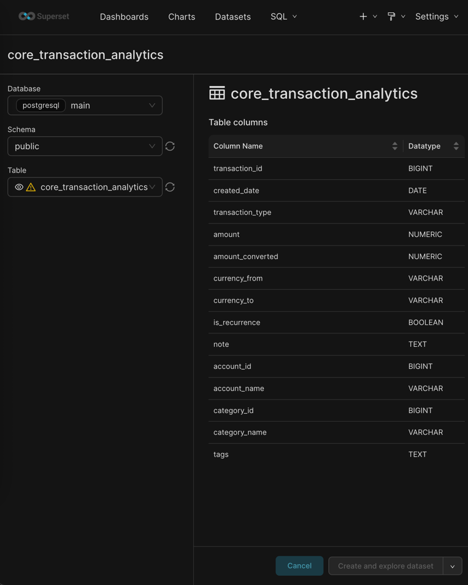

# Introductory
There is an application [CoinKeeper](https://about.coinkeeper.me/) that is used for tracking personal income and expenses. However, the application has limited capabilities when it comes to advanced analytics and building complex visualizations.

To address this limitation, the following solution was implemented:
1.	Expense data was exported from the CoinKeeper mobile application.
2.	The exported data was imported into a Postgres database.
3.	A materialized view was created in the database to support data aggregation and analytical queries.
4.	[Apache Superset](https://superset.apache.org/) was configured with a data source based on this materialized view, enabling the creation of flexible charts and analytical dashboards.

When running docker compose, the following services are started:
- a Django Admin web interface for managing the database content;
- an Apache Superset web interface for data visualization and analytics.

The setup and usage instructions are provided below.

# How to run
## Initialization
```shell
cp .docker/web/.env.debug .docker/web/.env
cp .docker/superset/.env.debug .docker/superset/.env

docker compose -f .docker/compose.yml up -d --build

docker compose -f .docker/compose.yml exec web ./manage.py migrate
docker compose -f .docker/compose.yml exec web ./manage.py create_super_user

docker compose -f .docker/compose.yml exec pg bash -c 'psql -U "$POSTGRES_USER" "$POSTGRES_DB" < /tmp/schema.sql'
```

## Import Data
1. Export transactions from the CoinKeeper mobile application.
2. Place the exported file in the project root as `rows.csv`.
3. Run the import command: `docker compose -f .docker/compose.yml exec web ./manage.py import`

## Access WEB Interfaces
- Django Admin: [localhost:8000/admin/](http://localhost:8000/admin/) - admin / admin
- Apache Superset [localhost:8088](http://localhost:8088) - admin / admin

## Create dataset at Superset
1. Open [creating form](http://127.0.0.1:8088/dataset/add/).
2. Compete form
    - Database: `main`
    - Schema: `public`
    - Table: `core_transaction_analytics`
3. Press button `Create and explore dataset`

[](docs/images/create-dataset.png)
